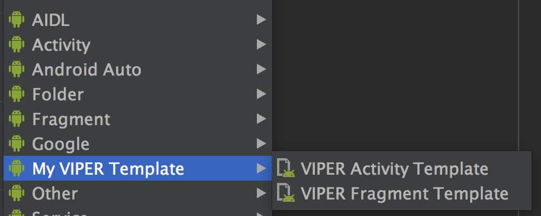
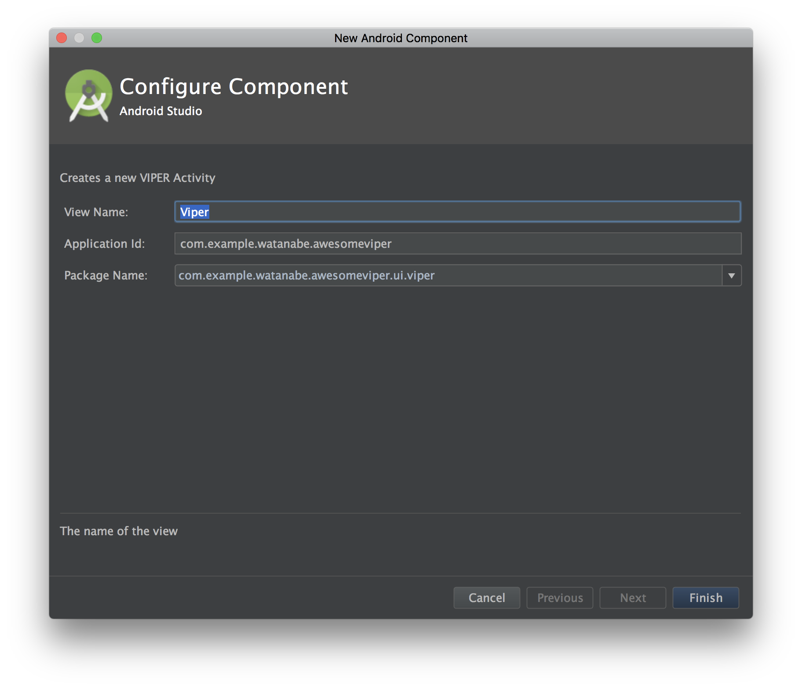
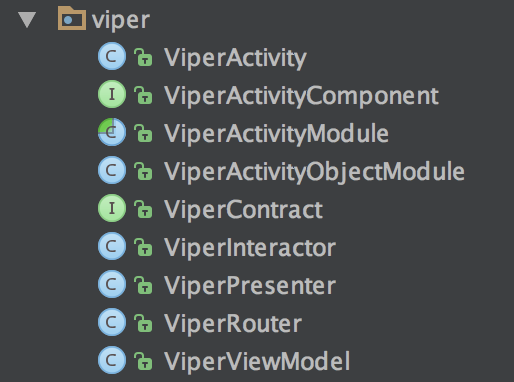

## About

VIPER activity template files for Android Studio.  
You can create classes and layout related VIPER architecture from template.







## Install

Run install script and restart Android Studio.

```bash
./install.sh
```

## Usage

### Activity

1. Select package to create files
2. Select File > New > My VIPER template > VIPER Activity
3. Input view function class name like `ViperActivity`, and appplication id, package name.
4. Click Finish
5. Add generated ActivityModule to AppComponent

```java
@Singleton
@Component(modules = {
        AndroidInjectionModule.class,
        AppModule.class,
        ViperModule.class // <- add
})
public interface AppComponent {

    public void inject(AwesomeApp app);
}
```

6. Add Activity to AndroidManifest.xml

```xml
<activity android:name=".ui.viper.ViperActivity"
  android:exported="false"
/>
```

### Fragment

1. Select package to create files
2. Select File > New > My VIPER template > VIPER Fragment
3. Input view class name like `ViperFragment`, and appplication id, package name.
4. Click Finish
5. Add generated FragmentModule to target ActivityComponent


```java
@Subcomponent(modules = {
        ViperActivityObjectModule.class,
        LoginFragmentModule.class // <- add
})
public interface ViperActivityComponent extends AndroidInjector<ViperActivity> {

    // ...
}
```


## Reference

https://riggaroo.co.za/custom-file-template-group-android-studiointellij/
